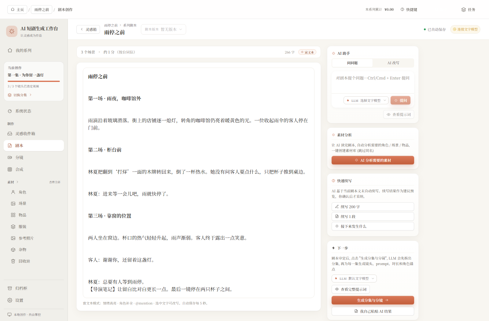
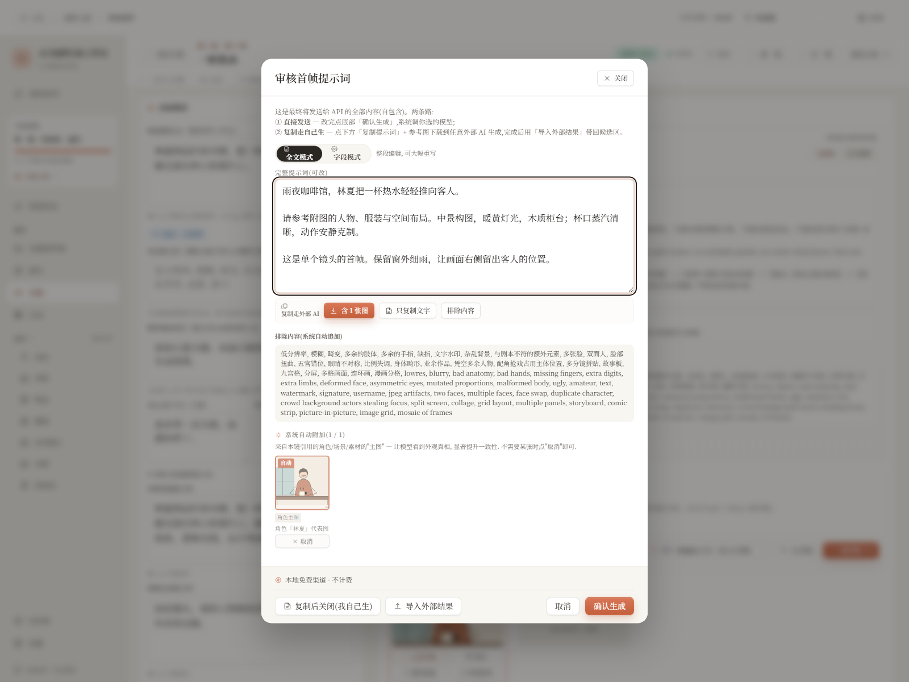

<div align="center">

# AI 短剧生成工作台

### 把故事拍出来，先从改好一个镜头开始。

AI Short Drama Workbench，面向 AI 短剧、AI 漫剧和剧情短片的本地创作工具。写剧本、管素材、做短片，接自己的模型。

[开始使用](#开始使用) · [让 AI 帮你安装](docs/AI_SETUP.md) · [看真实界面](docs/SHOWCASE.md) · [English](README.en.md)


</div>

做 AI 短片时，常常不是缺一个生成按钮，而是改完剧本后，要重新找人物图、翻提示词、对镜头、挑素材。

这个工作台把这些事放在一起。一个镜头不满意，就回到那个镜头继续改。已经写好的剧本、挑好的参考图、做好的视频，也可以接着用。

## 它适合怎么用？

**先把故事讲明白。** 写下或粘贴剧本，按集管理。编辑时自动保存，修改前后可以留版本，不必把“最终版2”散落在文件夹里。

**再把镜头做具体。** 排分镜、关联人物和场景。制作首帧时，可以检查提示词和参考图，再决定要不要生成；候选素材留在对应镜头下。

**最后把素材接起来。** 接自己的图像、视频或语音服务，也能导入已有素材。准备齐镜头后，再配置字幕与合成，导出视频。

| 写故事，留得住修改 | 做镜头，看得见依据 |
|---|---|
|  |  |

上方宣传图由真实截图排版制作；[原始截图、样例说明和操作步骤](docs/SHOWCASE.md) 可直接查看。演示故事与素材为专门制作的虚构样例，不代表云端模型的生成效果。

## 开始使用

**推荐 Windows + Node.js 24。** 安装 [Node.js](https://nodejs.org/) 后，下载仓库，或运行：

```sh
git clone https://github.com/CZ3744/ai-short-drama-workbench.git
cd ai-short-drama-workbench
npm ci
npm run doctor
```

Windows 双击 **`start-studio-hidden.vbs`**，准备好后会打开浏览器。地址是 [127.0.0.1:5173](http://127.0.0.1:5173)。结束时双击 `stop-studio.vbs`。

也可以运行 `npm run dev` 启动。macOS / Linux 尚未做与 Windows 同等程度的实机验收。

**不熟悉命令行？** 把 [这段安装指令](docs/AI_SETUP.md) 复制给你的 AI 编程助手，让它安装、检查环境，并实际验证剧本保存。

### 第一次打开，先做一件小事

新建一个系列 → 写一段剧本 → 等待保存 → 刷新确认内容还在。这个过程不需要 API Key。

想生成内容时，再去「设置」添加自己的模型。先配文字或图像服务就可以，不用一次配齐。合成视频需要 **FFmpeg / FFprobe**；安装后运行 `npm run doctor -- --require-media` 检查。

[完整新用户指南](docs/GETTING_STARTED.md) · [常见问题](docs/FAQ.md) · [遇到问题](docs/GETTING_STARTED.md#遇到问题)

## 使用前说清楚

- **工具免费，模型按服务商计费。** 本项目采用 MIT 许可，不提供共享 Key 或免费云端额度。支持范围以设置页现有适配器为准，并非任意视频 API 填进去都能用。
- **作品在本机，云端请求会出网。** 调用模型时，必要的提示词、素材和认证信息会发送到你选的服务商。仓库不包含作者的私人作品、数据库或凭据。详见 [隐私说明](docs/DISTRIBUTION.md)。
- **没有 Key 也能先整理创作。** 剧本编辑、分镜管理、素材导入可先用；本地演示卡片只用来试流程，不是 AI 生图效果。
- **目前处于 0.2.x 公开测试阶段。** 本地流程、浏览器操作与隔离回归都有验收，付费模型仍受各家服务的额度、协议和可用性影响。当前适合个人在本机使用。

## 一起把它做顺手

如果它帮你少翻了几个文件夹，欢迎点个 Star，方便以后回来。如果某一步卡住了，欢迎 [提一个问题](https://github.com/CZ3744/ai-short-drama-workbench/issues)，告诉我你想做什么、实际发生了什么；请先遮住密钥与私人内容。

[参与开发](CONTRIBUTING.md) · [版本说明](docs/RELEASE_NOTES.md) · [逐页验收截图](docs/VISUAL_REVIEW.md) · [AI 助手文档索引](llms.txt) · [安全问题](SECURITY.md) · [MIT 许可](LICENSE)

<details>
<summary>给开发者：结构与检查命令</summary>

```text
apps/web       React · Vite · Tailwind
apps/server    Express · TypeScript
packages       剧本 / 生成适配器 / 素材 / 文档 / 合成
config         公开默认配置与空示例
prompts        提示词模板
scripts        隔离测试、环境检查与发布工具
```

```sh
npm run build
npm test
npm run test:browser
npm run health:codebase
npm run check:privacy
```

浏览器测试首次需要安装 Chromium，或指定已安装的 Edge；具体方法见 [贡献指南](CONTRIBUTING.md)。测试使用临时数据与空凭据，截图和报告保存在 `.quality-reports/`。

</details>
