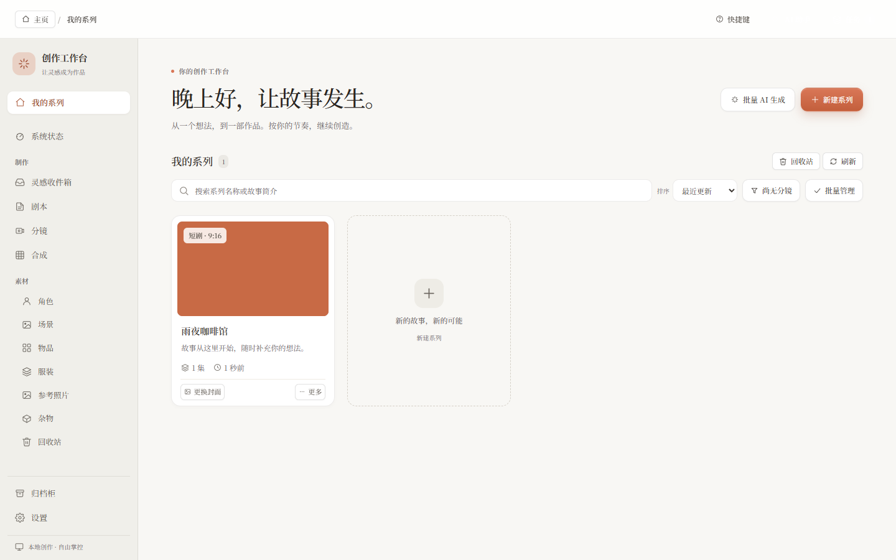
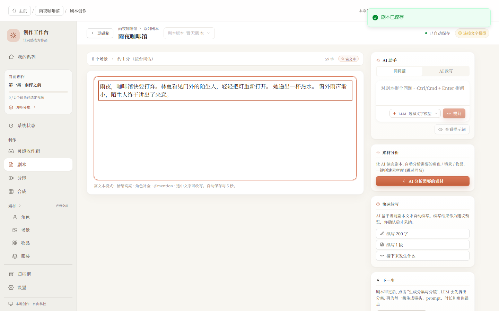
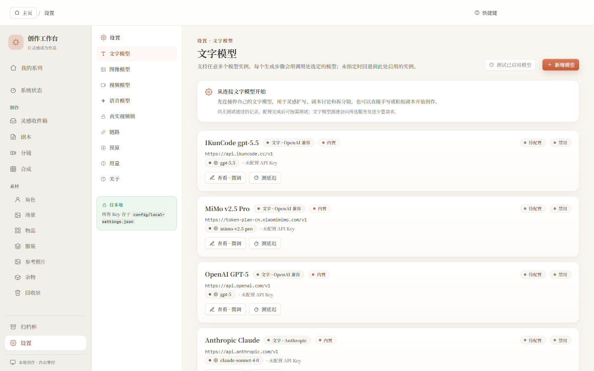

# AI 短剧工作台

**把灵感写成剧本，把分镜做成作品。** 一款本地运行、可逐步修改的 AI 视频创作工具，延续 Claude 的暖白与陶土色，结合 iOS 风格的柔和控件与清晰层次。



## 从想法到成片

灵感收集 → 剧本编辑 → 分镜规划 → 人物与场景 → 首帧与镜头视频 → 配音、字幕与合成。

每一步都能回看、修改与重新生成。你可以连接自己的文字、图像、视频和语音 API，也可以直接导入已有素材。作品、模型设置和密钥保存在自己的电脑上。

- **清晰的工作台**：搜索、排序、继续创作、批量管理，以及真实的加载和失败状态。
- **可靠的编辑**：剧本连续保存、失败重试、版本切换保护、镜头之间的状态隔离。
- **可控制的生成**：就近选择模型，生成前查看和编辑完整提示词及参考图片。
- **完整的素材流程**：人物、场景、物品、服装、参考照片、素材组、归档柜和回收站。
- **自己的模型与预算**：支持多种服务商和兼容接口；每位使用者提供自己的 API Key。
- **独立运行**：不依赖作者的账号、机器目录、数据库或作品。

## 开始使用

推荐 Node.js 24。安装依赖后，在 Windows 双击 `start-studio-hidden.vbs` 静默启动：

```sh
npm ci
```

打开 [本地工作台](http://127.0.0.1:5173)。在「设置」里添加自己的模型名称、服务地址、模型 ID 和 API Key。先写剧本或导入素材也可以，不必一次配齐所有服务。

开发模式使用 `npm run dev`。停止 Windows 后台工作台可双击 `stop-studio.vbs`。合成与导出需要 FFmpeg / FFprobe；请将两者加入 PATH；个别模块支持路径设置，但完整合成仍依赖 PATH。

详见 [新用户指南](docs/GETTING_STARTED.md) 和 [分发与隐私说明](docs/DISTRIBUTION.md)。

## 界面

| 剧本编辑 | 模型设置 |
|---|---|
|  |  |

[查看逐页截图与视觉验收](docs/VISUAL_REVIEW.md) · [本次升级说明](docs/RELEASE_NOTES.md)

## 配置与费用

模型凭据由使用者自行填写。`.env` 和 `config/local-settings.json` 不进入 Git；无需复制示例文件也能通过设置页配置。兼容接口的服务地址和模型 ID 以自己的服务商为准，内置列表是可选入口。

本地卡片图只用于样稿，不代表真实 AI 生图质量。真实云端生成由服务商计费；设置中的预算与单次请求预览帮助控制使用量。可选 GPU/Python 扩展需要单独安装，发布版默认停用未配置的本地扩展。

这是每位用户各自运行的桌面工作台。页面默认绑定本机回环地址；不要把未部署身份认证的本地 API 直接暴露到公网。

## 验证与开发

```sh
npx playwright install chromium # first browser-test setup
npm run build          # TypeScript + production frontend
npm test               # isolated unit / integration tests
npm run test:browser    # actual Chromium UI + screenshots, isolated sample data
npm run health:codebase # project health checks
npm run check:privacy   # tracked release content privacy scan
```

测试运行在临时源码副本中，不继承真实密钥，也不读取使用者作品。浏览器测试会保存截图和结构化结果到 `.quality-reports/`。真实付费模型生成需要使用者自己的凭据，不作为离线回归成功的声明。

```
apps/web       React · Vite · Tailwind
apps/server    Express · TypeScript
packages       core / drama / providers / document / library / render
config         public presets and empty configuration examples
prompts        editable prompt templates
scripts        isolated verification and release tools
```

## 许可

[MIT](LICENSE)。任何获得本项目副本的人都可以使用、修改和分发；第三方模型、服务和素材按各自条款使用。私有仓库的访问权限由仓库所有者管理。
