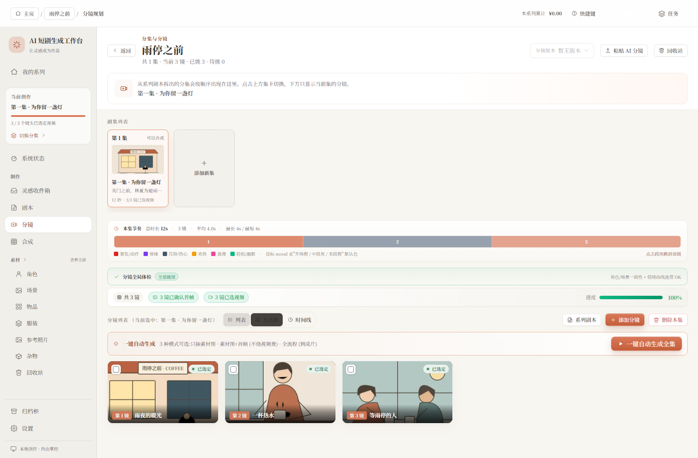
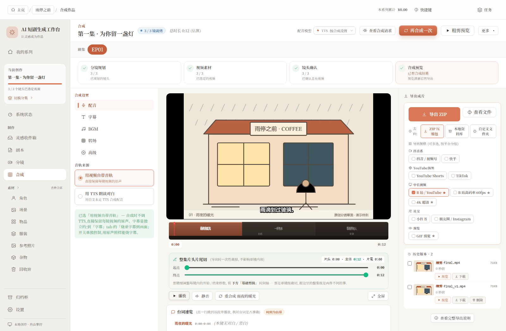

# 用三个镜头，讲一个小故事

下雨了，街上的店铺陆续关门。一间咖啡馆的灯还亮着，店主给躲雨的客人倒了一杯热水。

我们用这个虚构故事「雨停之前」，演示工作台里一次很普通的创作：写几段文字，安排三个镜头，选好素材，再准备合成。

本页五张原始界面截图已更新为 **0.2.2 · AI 短剧生成工作台 / AI Short Drama Workbench**，于 2026-10-08 使用新版实际运行的页面重拍。侧栏的新名称完整可读，保留原有暖纸白、陶土色和衬线文字。

## 先写下来

不用先想好模型、画风或预算。打开剧本页，把故事写完整。修改时能看到保存状态，也可以保留版本。


## 看看镜头是否接得上

远景交代雨夜，中景拍递杯子的动作，最后留在窗边。分镜放在一起，比只看一长段文字更容易发现节奏问题。



## 生成前，把要求看清楚

先检查人物、参考图和要发送的提示词。想改画面，就在这个镜头上改；不必重新开始整个项目。


## 选好素材，再合成

示例中导入了三个本地视频片段。合成页会显示镜头准备情况，再由你选择字幕和其他设置。素材还没齐时，先回到对应镜头补上。



## 宣传图与原始截图


宣传图使用 imagegen 对真实截图做展示排版，可能有缩放、透视和文字细节的重绘；请以本页原始截图为准。它没有展示云端模型生成的成片。

本次生图使用的原始参考：[剧本](media/reference/hero-script.png)、[工作台](media/reference/hero-studio.png)、[提示词审核](media/reference/prompt-review.png)。

本页截图来自实际运行的浏览器页面，使用独立的空配置、空凭据和样例数据库。没有读取作者的作品，也没有调用付费模型。

本次重拍同时通过 7 项连续操作检查：新建系列、设置角色代表图、导入素材并选择首帧、审核提示词与参考图、选择画幅并合成播放、导出本地 ZIP、编辑剧本并核对保存结果。页面错误与外部请求均为 0，详见 [运行结果](media/source/summary.json) 与 [界面验收记录](VISUAL_REVIEW.md)。

故事为本项目编写的虚构样例。画面是脚本绘制的原创 SVG 分镜草图，视频是这些草图制作的静态片段，均用于说明操作流程。它们不代表 AI 图像、视频或配音的生成质量。

安装依赖和 FFmpeg 后，可以在本地复现这组截图：

```sh
npm run build
node scripts/run-showcase.mjs
```

脚本使用临时数据，运行结束后清理自己的临时副本。只有成功后才会更新 `docs/media/source/`；完整过程保存在忽略的 `.quality-reports/` 中。

[开始使用](GETTING_STARTED.md) · [让 AI 帮你安装](AI_SETUP.md) · [返回首页](../README.md)
